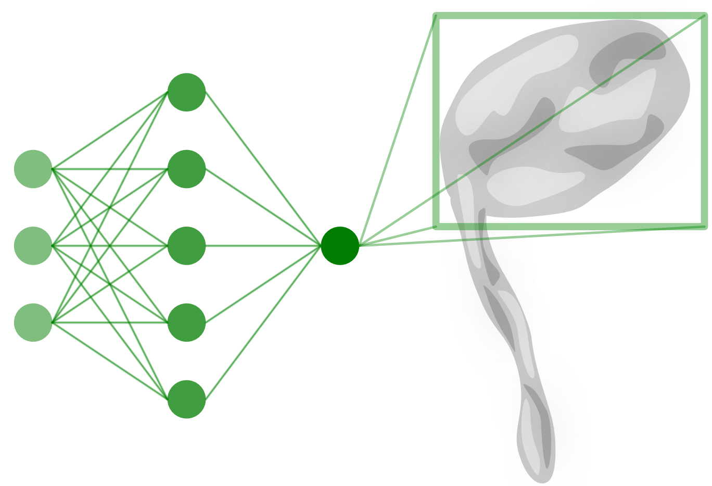
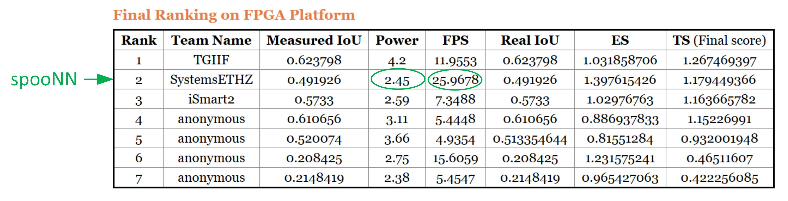

# spooNN

This is a repository for FPGA-based neural network inference, that delivered the highest FPS in the international contest for object detection as part of Design Automation Conference 2018 (https://www.dac.com/content/2018-system-design-contest). The contents of spooNN enable an end-to-end capability to perform inference on FPGAs; starting from training scripts using Tensorflow to deployment on hardware (PYNQ http://www.pynq.io/).

The final rankings are published at http://www.cse.cuhk.edu.hk/~byu/2018-DAC-SDC/index.html

## Repo organization
- hls-nn-lib: A neural network inference library implemented in C for Vivado High Level Synthesis (HLS).
- mnist-cnn: helloworld project, showing an end-to-end flow (training, implementation, FPGA deployment) for MNIST handwritted digit classification with a convolutional neural network.
- halfsqueezenet: The object detection network, that ranked second in DAC 2018 contest, delivering the highest FPS at lowest power consumption for object detection.
